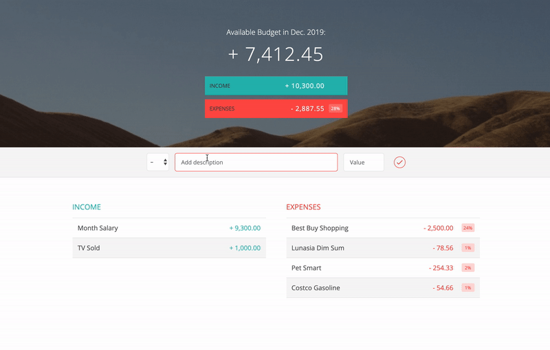

# Project Budgety
**Self learning project from Udemy.com taught by Jonas Schmedtmann**

Main focus of this project is to learn more advanced JavaScript (ES2015+) knowledge from the project budgety.

Jonas Schemedtmann provides the starter project code and the final version of the project. I will build the project one step by one based on the starter code. Hopefully, ended the project before the end of 2019.

## Project Snapshot

## Update History (Project finished on 12.20.2019)
12.21.2019
- Fix ES6/ES2015 errors
- Code clean up

12.20.2019
- Update item display format
- Update time label in UI based on current Date
- Update the input indicator color for different type
- Update project snapshot to gif version

12.19.2019
- Add delete item event listener to main controller
- Add deleteItem function to budget controller
- Add deleteListItem function to UI controller
- Add Expense percentage attribute to its prototype
- Add single expense item percentage calcualte and get functions to budget controller
- Add single expense item percentage display function to UI controller 

12.18.2019
- Update the updateBudget function in budget controller
- Update the displayBudge function in the UI controller
- Deal with the case when only has expense items in displaying
- Update the init function in main controller for UI part
- Update the project snapshot

12.08.2019
- Update the clearFields function to clean up the input area
- Fix the bug that income and expense will not add empty fields

12.03.2019
- Add addItem method to budget controller
- Add addItemList method to insert adjacent HTML into DOM
- Update DOMstrings

12.02.2019
- Create data structures in data model

12.01.2019
- Abstract the query selectors to one private object
- Add click event listener for input button
- Add keypress event listern to the main document self

