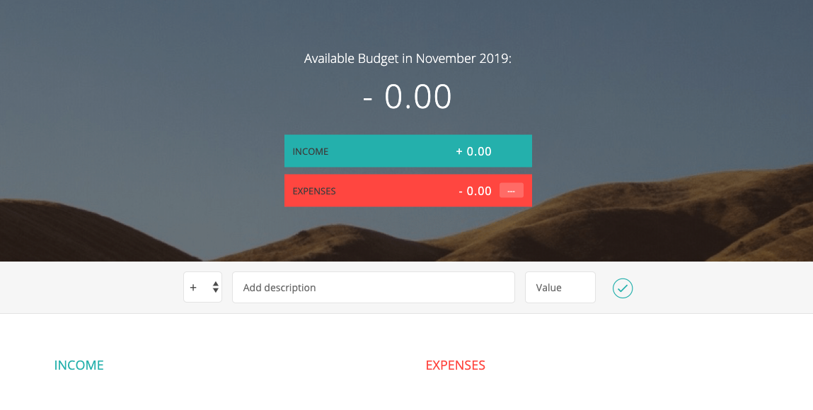

# Project Budgety
**Self learning project from Udemy.com taught by Jonas Schmedtmann**

Main focus of this project is to learn more advanced JavaScript (ES2015+) knowledge from the project budgety.

Jonas Schemedtmann provides the starter project code and the final version of the project. I will build the project one step by one based on the starter code. Hopefully, ended the project before the end of 2019.

## Project Snapshot

## Update History
12.03.2019
- Add addItem method to budget controller
- Add addItemList method to insert adjacent HTML into DOM
- Update DOMstrings
12.02.2019
- Create data structures in data model
12.01.2019
- Abstract the query selectors to one private object
- Add click event listener for input button
- Add keypress event listern to the main document self

